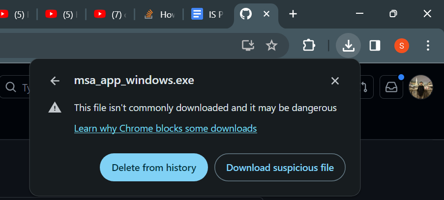
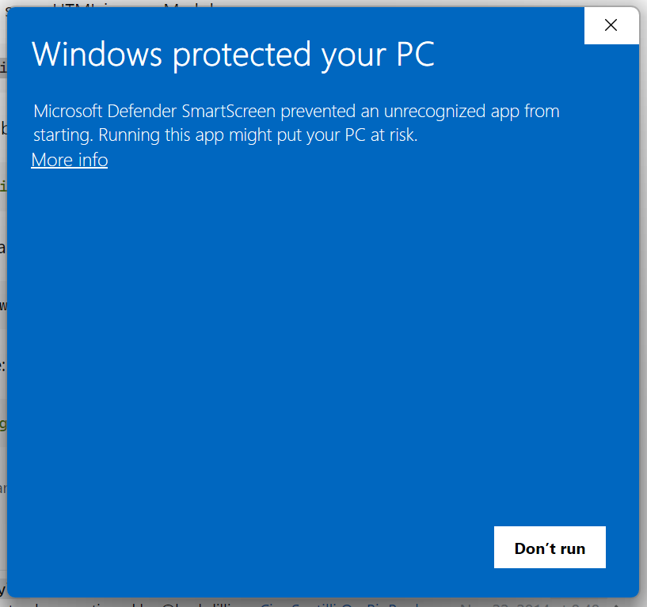

# A Cross-Platform app for Lesion-Symptom Mapping Analysis using Multi-perturbation Shapley-Value Analysis


## Introduction
This application is a graphical user interface version for the methodology described in this [paper](https://academic.oup.com/braincomms/article/3/3/fcab204/6362866), allowing users without programming experience to perform Lesion-Symptom mapping on stroke datasets.

## 🚀 Getting Started
### 📥 Downloading
Download the latest release for your operating system from the [release section](https://github.com/ShreyDixit/MSA-App/releases). Follow the OS-specific instructions provided below.

**Note:** Your browser or antivirus might issue a warning due to the application being bundled into a single file using `PyInstaller`. This is a standard caution for unrecognized apps but rest assured, the software is secure and open-source.

Example warning in Chrome:



Ignore any such warnings and proceed with the download.

### 🔑 Starting the Application
#### Windows
You might encounter a security warning when running the application:



Click on `More Info` followed by `Run Anyway` to launch the app.

#### Linux/Remote Linux Server
In case you are running the application on a remote Linux server, X11 forwarding needs to be enabled to support the GUI. Achieve this with:
```bash
ssh -X username@host
```
Now you need to modify the permissions of the file, making the file executable. For this, run the following command:
```bash
chmod +x msa_app_linux
```
Now you can simply start the application using the following command:
```bash
./msa_app_linux
```

**Note:** The application is compiled for `ubuntu-20.04`. Compatibility issues may arise with other Linux distributions.

### 📂 Data Preparation
The application requires three files (one optional):

1. **Lesion Data File:** Acceptable in either `csv` or `xlsx` format. An example of this file can be found [here](https://github.com/ShreyDixit/MSA-App/blob/master/data/roi_data.csv). The file should contain patient data with each row representing a patient. Columns should label brain ROIs, showing the percentage alteration in each (values between 0 and 100).
2. **Score File:** Acceptable in either `csv` or `xlsx` format. An example of this file can be found [here](https://github.com/ShreyDixit/MSA-App/blob/master/data/nihss_scores.csv). This file should contain the scores for each patient. The score can be a measure of either deficit or the performance of the patient after the stroke.
3. **Voxels File:** TThis optional file is needed if you wish to run the analysis until only a few ROIs are left, excluding the non-significant contribution from the Rest of the Brain (ROB). An example is available [here](https://github.com/ShreyDixit/MSA-App/blob/master/data/num_voxels.csv). This file has the number of voxels for each brain ROI.

### Options
The GUI offers several configurable options:

1. Type of Score: Choose whether the final data column represents the deficit or a performance metric. Performance metrics should inversely correlate with stroke severity. For deficit scores, the application converts them into performance metrics by subtracting the maximum NIHSS Score from the score of each patient.
2. Machine Learning Model: You can use a variety of Machine Learning models. However, according to our data and experimentation, a Support Vector Regressor works best.
3. Run Iterative: If enabled, it will run the MSA iteratively until the smallest set of ROI are left with a non-significant contribution from the ROB.
4. Run Network Interaction: If enabled, it will calculate the network interaction of each ROI pairs after the MSA. The interaction between two regions quantifies how much the contribution of the two regions considered jointly is larger or smaller than the sum of the contribution of each of them individually when the other one is lesioned.
5. Binarize Data: Binarizes stroke data by setting values below the median to 0, and above to 1.
6. Add ROB if not present: This option will add an ROB (Rest of the Brain) column in the data with 0 percentage of alteration and 0 number of voxels if ROB doesn't already exist in the lesion data file. This is essential for performing iterative MSA.

### Advanced Options
MSA usually works without having to tinker with these options so only do so if you really know what you're doing.

1. Random Seed: A random seed to pass in order to have a different random state.
2. Num Permutations: Number of Permutations to use for running MSA. 1000 is almost exhaustive for 10 ROI but also works well for more. Increasing this might lead to better results but will definitely increase the computation time linearly.
3. **Full MSA**: This option allows you to perform an "almost" full MSA analysis. This means that every possible combination of lesions is passed as the lesion data, and the MSA calculates the precise contribution of each ROI. You can create a synthetic dataset using the script available [here](https://github.com/ShreyDixit/MSA-App/blob/master/data/create_synthetic_data.py). However, caution is advised when using this option because the data must contain \(2^n\) rows, where \(n\) is the number of ROIs. This requirement can lead to a rapid increase in data size; for instance, 25 ROIs would result in 33 million rows. Additionally, due to implementation convenience, this is considered Full MSA only for up to 11 ROIs. Beyond that, the analysis processes a minimum of 99.5% of all combinations.

## TODO:
- Better Styling of the Application
- More Tests
- Docs and Instructions for Operating Systems I missed
- Add none ML model (Add a check)
- Show how many ROI left at each step